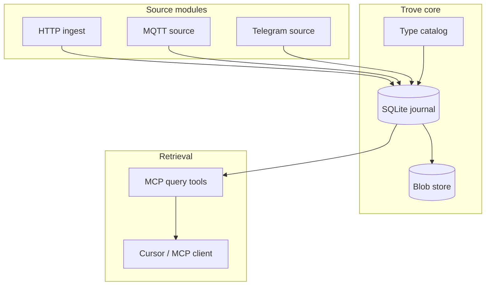

# Core Concepts

Trove is built around a few ideas that work together: immutable events in an
append-only journal, optional blob attachments, dynamically loaded source
modules, and conversational retrieval via MCP.

## Events

The fundamental unit of data — an immutable fact with a ULID, timestamp, typed
namespace, source identifier, and JSON payload. Types are `trove://` URIs
registered in the local type catalog; payloads are validated against JTD contracts.

[Events](./concepts/events.md)

## Type catalog

Local registry of event payload contracts — `trove://` URIs, TTD files, and
`schema_ref` on validated journal events.

[Type catalog](./concepts/type-catalog.md)

## Journal

Append-only SQLite store. Single source of truth for all captured events.

[Journal](./concepts/journal.md)

## Blobs

Content-addressed storage for large attachments, referenced from events by hash.

[Blobs](./concepts/blobs.md)

## Sources

Modules that emit events — HTTP ingest, MQTT, Home Assistant, and others.

[Sources](./concepts/sources.md)

## Modules

Discovery, manifests, and the go-plugin runtime for local modules; gRPC for
remote edge devices.

[Modules](./concepts/modules.md)

## Query

Internal RPC API and MCP tools for conversational retrieval.

[Query](./concepts/query.md)

## Processors and sinks

Derived events and side-effect handlers — deliberately minimal in v0.

[Processors and sinks](./concepts/processors-and-sinks.md)

## How it fits together

1. **Source modules** capture facts and call `Emit(event)` into the core.
2. The **journal** persists events append-only in SQLite.
3. Large payloads go to the **blob store**; events hold a `blob_ref`.
4. The **type catalog** validates payloads against JTD contracts at emit time.
5. **MCP query tools** search and summarize the journal for conversational use.

For implementation order, see the [roadmap](./roadmap.md).
