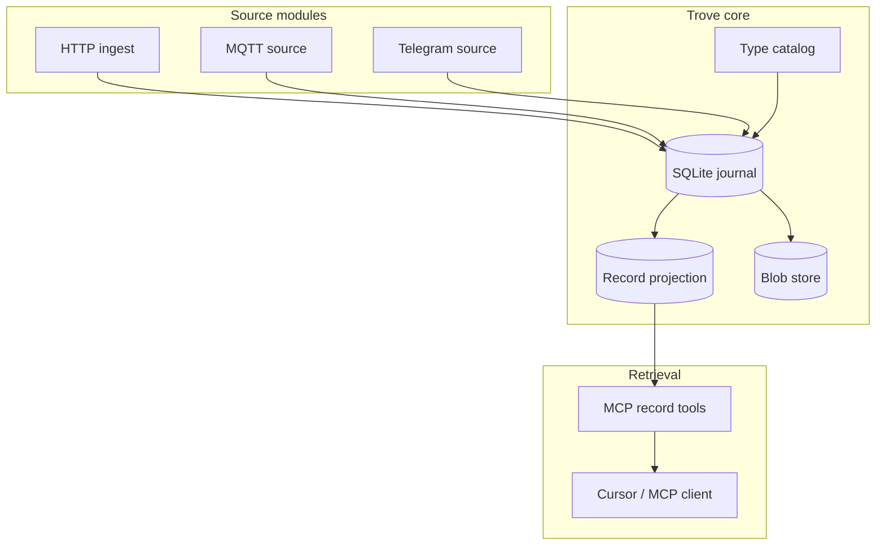

# Core Concepts

Trove is an append-only **personal content graph**: immutable **revisions** in a
journal, folded **records** as queryable nodes, optional **references** between
records and blobs (planned), dynamically loaded **modules** that enrich and connect
captures, and conversational retrieval via MCP.

> Capture broadly, store simply, converse to retrieve.

Share anything with minimal typing; modules classify, link, and enrich later.

## Revisions

The fundamental journal unit — an append-only row with ULID, timestamp, operation,
`record_ref`, typed namespace, source identifier, and JSON payload. Types are
`trove://` URIs registered in the local type catalog; payloads are validated against
JTD contracts.

[Revisions](./concepts/revisions.md)

## Records

Folded projections at `(record_ref, version)` — the primary MCP search surface.
Records can link to other records, blobs, and external URLs via **references**
(planned).

[Records](./concepts/records.md)

## Type catalog

Local registry of payload contracts — `trove://` URIs, TTD files, and
`schema_ref` on validated journal revisions.

[Type catalog](./concepts/type-catalog.md)

## Journal

Append-only SQLite store. Single source of truth for all captured revisions.

[Journal](./concepts/journal.md)

## Blobs

Content-addressed storage for large attachments, referenced from revisions by
`blob_ref` / `content_ref` (and via `references` when planned).

[Blobs](./concepts/blobs.md)

## Sources

Modules that append revisions — HTTP ingest, MQTT, Telegram, and others.

[Sources](./concepts/sources.md)

## Modules

Discovery, manifests, and the go-plugin runtime for local modules; gRPC for
remote edge devices.

[Modules](./concepts/modules.md)

## Query

Internal RPC API and MCP tools for conversational retrieval over records.

[Query](./concepts/query.md)

## Processors and sinks

Derived revisions and side-effect handlers — deliberately minimal in v0.

[Processors and sinks](./concepts/processors-and-sinks.md)

## How it fits together

1. **Source modules** capture facts and call `AppendRevision` into the core.
2. The **journal** persists revisions append-only in SQLite.
3. The **materializer** folds revisions into queryable **records**.
4. Large payloads go to the **blob store**; revisions hold a `blob_ref`.
5. The **type catalog** validates payloads against JTD contracts at append time.
6. **MCP record tools** search folded records for conversational use.

For the content graph model (references, link/unlink, URIs), see
[planning/references.md](./planning/references.md).

For implementation order, see the [roadmap](./roadmap.md).
