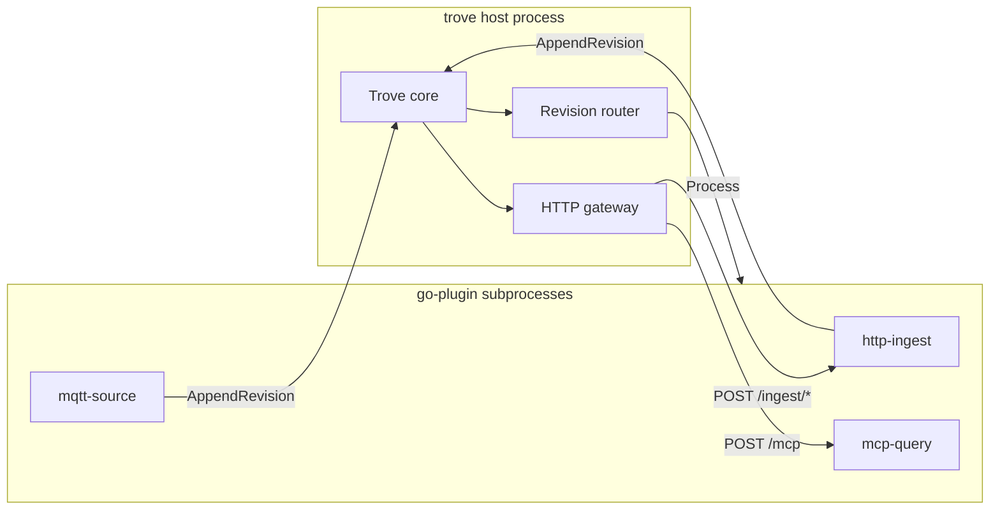

# Modules

Modules are **separate processes**, discovered from `[modules].paths` in config
and connected to the Trove core over a local (or networked) socket.



See [spec §8](../spec.md#8-module-architecture-dynamic-socket-based).

## Built-in modules

`http-ingest`, `mcp-query`, and `type-catalog` ship **inside the `trove` binary**. The core
discovers them automatically when no on-disk module with the same `name` exists
in `[modules].paths`. Built-ins still run as go-plugin subprocesses (the core
reexecs `trove` with `TROVE_BUNDLED_MODULE` set); only the packaging differs.

To override a built-in, install a module directory with the same `name` under a
configured path — filesystem discovery runs first, so the on-disk binary wins:

```
~/.local/lib/trove/modules/http-ingest/
    manifest.toml
    module
```

Other first-party modules (MQTT, Telegram, capture classifier) remain separate
binaries built by `make build`.

## Discovery paths

Modules are discovered from `[modules].paths` in `trove.toml`. Common install
locations:

```
/usr/lib/trove/modules/
/usr/local/lib/trove/modules/
~/.local/lib/trove/modules/
```

Each module is a directory:

```
module/
    manifest.toml
    module          # executable
```

```toml
name     = "mqtt-source"
version  = "1.0"
kind     = "source"        # source | processor | sink
provides = ["trove://type/mqtt/message/received/1"]
```

## Declaring subscriptions and emissions

Modules declare journal revision types in the manifest:

| Field | Role |
|-------|------|
| `provides` | Revision types the module may emit (sources and revision-routing processors) |
| `consumes` | Revision types the module subscribes to (revision-routing processors and sinks) |

Both fields accept exact `trove://type/...` URIs or glob patterns
(`trove://type/note/*`, `trove://type/mqtt/*/received/*`). Bare `*` is not allowed.

Revision-routing processors and sinks must declare `consumes`. Sources must declare
`provides`. HTTP-only processors (for example `mcp-query`) declare
`[[http.routes]]` instead and do not participate in journal routing.

## Revision routing and loop prevention

When a revision is appended to the journal, the core dispatches it to every module
whose `consumes` patterns match the revision type. Processors may return derived
revisions; the core validates those against `provides` and appends them.

Routing metadata is **not** stored on journal revisions. The core passes a
`DispatchContext` alongside each `Process` / `Handle` call:

- `root_id` — journal ID of the revision that started the processing chain
- `seen` — module names that have already handled this chain

If a module sees its own name in `seen`, it skips the revision. Derived revisions
inherit the parent's `seen` list so cycles such as `A → B → A` terminate. This
follows the same principle as Meshtastic packet deduplication: track what has
already handled the chain and do not process it again.

## Provenance: producer vs source

| Field | Set by | Meaning |
|-------|--------|---------|
| `source` | Module / caller | External origin (MQTT topic, Telegram chat, device name) |
| `producer` | **Host** (planned) | Authenticated module identity (e.g. `module.http-ingest`) |

Modules supply `source` on every `AppendRevision`. The host will stamp `producer`
at the RPC boundary; modules must not set it themselves. See
[planning/references.md](../planning/references.md).

## What to persist

| Situation | Revision op |
|-----------|-------------|
| Enrich the same shared capture | `apply` or `link` on existing `record_ref` |
| Create a distinct entity (person, derived doc) | `apply` (new record) + `link` from parent |
| Rebuildable index (FTS, embeddings) | Projection only |

Full rules: [planning/references.md](../planning/references.md).

## Local vs remote

| Path | Mechanism |
|------|-----------|
| Local | [hashicorp/go-plugin](https://github.com/hashicorp/go-plugin) — subprocess, gRPC, crash isolation |
| Remote (Tailscale) | Plain gRPC listener; edge device dials in — go-plugin does not support real networks |

Trove writes discovery (scan paths, read manifests); go-plugin handles launch
and transport once given a binary path.

## RPC surface

```
CoreServices : module calls AppendRevision, BlobPut, query, and type-catalog RPCs on the parent
SourceModule : parent calls Run to start a source subprocess
ProcessorModule : parent calls Process(revision, context) -> []revision
SinkModule     : parent calls Handle(revision, context) -> ack
HTTPModule     : gateway calls HandleHTTP for declared routes
CLIModule      : host calls RunCommand for one-shot CLI dispatch
All kinds      : Healthcheck periodically
```

At runtime, **source**, **HTTP**, **CLI/MCP**, and **revision-routing** modules are started.
The core runs a revision router that subscribes to the journal and dispatches to
matching processors and sinks.

## Implementation

- [Module runtime](../planning/module-runtime.md) — milestone 1
- [CLI commands](../planning/cli-commands.md) — module CLI registration
- [Type introspection](../planning/type-introspection.md) — catalog list/export/validate
- [Processors and sinks](../planning/processors-sinks.md) — revision routing
- [References](../planning/references.md) — links, attachments, producer
- [Remote modules](../planning/remote-modules.md) — later
- [Building modules](../building-modules.md) — author guide
