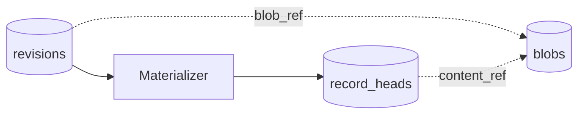

# Records

A **record** is a versioned, rebuildable index entry — the primary query and search
surface in Trove. Records are **not** stored as independent facts; they are
**projections** materialized by replaying journal **revisions** for a stable `record_ref`.

See [spec §3](../spec.md#3-core-concepts) and [planning/records.md](../planning/records.md).

## Revisions vs records vs blobs

| Layer | Role |
|-------|------|
| **Revision** | Append-only journal row — audit log, replay source |
| **Record** | Folded view at `(record_ref, version)` — MCP search target |
| **Blob** | Content-addressed bytes — referenced by `blob_ref` / `content_ref` |

## Vocabulary

| Term | Meaning |
|------|---------|
| `record_ref` | Stable record identity (ULID); assigned on first `apply` |
| `version` | Monotonic integer per `record_ref` |
| `body` | Folded JSON state from payload + transforms |
| `type` | `trove://type/...` catalog URI when known |
| `operation` | Journal verb: `apply` or `delete` |
| `completeness` | `incomplete`, `complete`, or `deleted` (on record head only) |
| `content_ref` | Folded primary blob reference |

## Operations

### `apply`

- **Without `record_ref`:** server allocates `record_ref`, opens new record (ingest, capture, MQTT one-shots).
- **With `record_ref`:** stack change onto existing record (classify, enrich).

Payload merges into body (RFC 7396). Transforms apply RFC 6902 patches after merge.

### `delete`

- Requires existing `record_ref`.
- Sets `completeness = deleted`.
- **Body is retained** for audit; default search excludes deleted records.

## Immutability

Revisions are never mutated. Record "changes" are new revisions materialized into
a new `version` on `record_heads`. Wipe `record_heads` and replay revisions to rebuild.

## Type catalog

TTDs validate the folded **body** when a record type is set. Captures without a type
remain `incomplete` until a later `apply` sets `type`.

## Implementation

**Status:** Supported — [planning/records.md](../planning/records.md)
