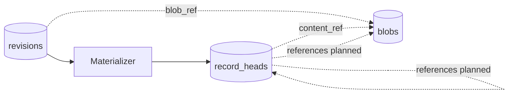

# Records

A **record** is a versioned, rebuildable index entry — the primary query and search
surface in Trove. Records are **not** stored as independent facts; they are
**projections** materialized by replaying journal **revisions** for a stable `record_ref`.

See [spec §3](../spec.md#3-core-concepts) and [planning/records.md](../planning/records.md).

## Revisions vs records vs blobs

| Layer | Role |
|-------|------|
| **Revision** | Append-only journal row — audit log, replay source |
| **Record** | Folded view at `(record_ref, version)` — MCP search target |
| **Blob** | Content-addressed bytes — referenced by `content_ref` or `references` |



## Vocabulary

| Term | Meaning |
|------|---------|
| `record_ref` | Stable record identity (ULID); assigned on first `apply` |
| `version` | Monotonic integer per `record_ref` |
| `body` | Folded JSON state from payload + transforms |
| `type` | `trove://type/...` catalog URI when known |
| `operation` | Journal verb on the revision that produced this version |
| `completeness` | `incomplete`, `complete`, or `deleted` (on record head only) |
| `content_ref` | Folded primary blob reference |
| `references` | Folded list of `{ ref, rel? }` edges (**planned**) |

## References

**Status: Planned** — [planning/references.md](../planning/references.md)

A **reference** is a directed edge to any absolute URI:

```json
{ "ref": "trove://record/01JREC...", "rel": "mentions" }
{ "ref": "trove://blob/sha256-abc...", "rel": "cover" }
{ "ref": "https://example.com/article" }
```

- `ref` is required; `rel` is optional and names the relationship when needed.
- **Attachments** are blob refs in `references` (not inlined in `body`).
- Attachment metadata (caption, etc.) lives in the typed **body**, keyed by ref URI.
- External URLs are first-class refs.

Record-to-record links use `trove://record/{ulid}`. Audit pointers use
`trove://revision/{ulid}`.

## Operations

### `apply` (supported)

- **Without `record_ref`:** server allocates `record_ref`, opens new record (ingest, capture, MQTT one-shots).
- **With `record_ref`:** stack change onto existing record (classify, enrich).

Payload merges into body (RFC 7396). Transforms apply RFC 6902 patches after merge.

### `delete` (supported)

- Requires existing `record_ref`.
- Sets `completeness = deleted`.
- **Body is retained** for audit; default search excludes deleted records.

### `link` / `unlink` (planned)

Add or remove reference edges without merging domain body. See
[planning/references.md](../planning/references.md).

## Immutability

Revisions are never mutated. Record "changes" are new revisions materialized into
a new `version` on `record_heads`. Wipe `record_heads` and replay revisions to rebuild.

## Type catalog

TTDs validate the folded **body** when a record type is set. Captures without a type
remain `incomplete` until a later `apply` sets `type`.

## Implementation

| Area | Status |
|------|--------|
| `apply`, `delete`, `content_ref` | Supported — [planning/records.md](../planning/records.md) |
| `references`, `link`, `unlink` | Planned — [planning/references.md](../planning/references.md) |
