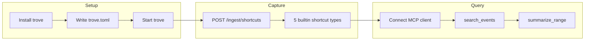

# Try Trove in a day

This is a single afternoon experiment. By the end you will have installed Trove,
captured several typed events using built-in shortcut types, and retrieved them
conversationally through MCP.

> **Goal:** prove the capture → journal → query loop works on your machine before
> committing to a longer run.



## What you need

- A laptop running Linux, macOS, or Windows (WSL)
- About two hours (phone optional for the last step)
- [Cursor](https://cursor.com) or another MCP client (optional but recommended)

## Phase 1 — Setup (~30 min)

### Install Trove

Download a release binary for your platform — see
[Installation](./installation.md). Or build from source if you prefer:

```bash
git clone https://github.com/joshmcarthur/trove.git
cd trove
make build
```

Verify:

```bash
./bin/trove -version
```

### Create a config file

Save this as `trove.toml` in your working directory:

```toml
[journal]
path = "./trove.db"

[blobs]
backend = "filesystem"
path = "./blobs"

[modules]
paths = ["./modules"]

[http]
listen = "127.0.0.1:8080"
```

Binding to `127.0.0.1` keeps ingest and MCP on localhost during the experiment.
See [Configuration](./configuration.md) for the full reference.

### Start Trove

From the repo root (after `make build` so module binaries exist):

```bash
./bin/trove -config ./trove.toml
```

Leave this running in a terminal. You should see the HTTP gateway start on port
8080.

### Smoke test

In another terminal:

```bash
curl -sS -o /dev/null -w "%{http_code}\n" \
  -X POST "http://127.0.0.1:8080/ingest/test" \
  -H "Content-Type: application/json" \
  -d '{"text":"hello trove"}'
```

Expected: `204`. This creates an event with the default type
`trove://type/http/ingest/received/1`.

- [ ] Trove starts without errors
- [ ] Smoke test returns `204`

## Phase 2 — Capture menu (~45 min)

Trove ships five **built-in shortcut types** for common capture patterns. Post
one event of each kind to `POST /ingest/shortcuts`. The `:source` path segment
(`shortcuts`) becomes the event `source` field.

Run these from another terminal while `trove` is running:

### Quick note

```bash
curl -sS -o /dev/null -w "%{http_code}\n" \
  -X POST "http://127.0.0.1:8080/ingest/shortcuts" \
  -H "Content-Type: application/json" \
  -d '{"type":"trove://type/shortcuts/note/created/1","text":"my first note"}'
```

Type: `trove://type/shortcuts/note/created/1` — expect `204`.

### Share sheet (URL + text)

```bash
curl -sS -o /dev/null -w "%{http_code}\n" \
  -X POST "http://127.0.0.1:8080/ingest/shortcuts" \
  -H "Content-Type: application/json" \
  -d '{"type":"trove://type/shortcuts/share/saved/1","title":"Example page","url":"https://example.com/article","text":"saved for later","content_type":"url"}'
```

Type: `trove://type/shortcuts/share/saved/1` — expect `204`.

### URL bookmark

```bash
curl -sS -o /dev/null -w "%{http_code}\n" \
  -X POST "http://127.0.0.1:8080/ingest/shortcuts" \
  -H "Content-Type: application/json" \
  -d '{"type":"trove://type/shortcuts/url/saved/1","url":"https://example.com","title":"Example Site"}'
```

Type: `trove://type/shortcuts/url/saved/1` — expect `204`.

### Location check-in

```bash
curl -sS -o /dev/null -w "%{http_code}\n" \
  -X POST "http://127.0.0.1:8080/ingest/shortcuts" \
  -H "Content-Type: application/json" \
  -d '{"type":"trove://type/shortcuts/location/checked/1","latitude":37.7749,"longitude":-122.4194,"label":"Home"}'
```

Type: `trove://type/shortcuts/location/checked/1` — expect `204`.

### Clipboard

```bash
curl -sS -o /dev/null -w "%{http_code}\n" \
  -X POST "http://127.0.0.1:8080/ingest/shortcuts" \
  -H "Content-Type: application/json" \
  -d '{"type":"trove://type/shortcuts/clipboard/saved/1","text":"copied text from the experiment"}'
```

Type: `trove://type/shortcuts/clipboard/saved/1` — expect `204`.

### Quick verify (optional)

List registered types from the CLI:

```bash
./bin/trove -config ./trove.toml types list
```

Or run the smoke script that posts all six payloads at once:

```bash
./examples/day-one/smoke.sh http://127.0.0.1:8080
```

Example payloads also live in
[`examples/ios-shortcuts/payloads/`](https://github.com/joshmcarthur/trove/tree/main/examples/ios-shortcuts/payloads).

- [ ] Six events captured (five shortcut types + one default ingest)
- [ ] Every `curl` returned `204`

## Phase 3 — Query back (~30 min)

### Connect Cursor

Create or edit `.cursor/mcp.json` (project) or `~/.cursor/mcp.json` (global):

```json
{
  "mcpServers": {
    "trove": {
      "url": "http://127.0.0.1:8080/mcp"
    }
  }
}
```

Reload Cursor (Settings → MCP). The `trove` server should show as connected with
at least four core tools. Full setup: [MCP client setup](./mcp-client.md).

### Try these queries

Ask your MCP client to call:

**Search by keyword:**

```json
{ "query": "my first note" }
```

Tool: `search_events` — should return the quick note event.

**Filter by type:**

```json
{ "type": "trove://type/shortcuts/note/created/1" }
```

Tool: `get_events_by_type` — should return note events only.

**Summarize today:**

```json
{
  "time_from": "2026-07-12T00:00:00Z",
  "time_to": "2026-07-13T00:00:00Z"
}
```

Tool: `summarize_range` — adjust dates to today; should show counts by type.

**List types** (when `type-catalog` module is loaded):

Tool: `list_types` — enumerates all registered builtin types.

- [ ] MCP client connects to `http://127.0.0.1:8080/mcp`
- [ ] `search_events` finds "my first note"
- [ ] `get_events_by_type` returns shortcut note events
- [ ] `summarize_range` reflects today's captures

## Phase 4 — Phone optional (~30 min)

The shortcut types above are the same contracts used by importable iOS
Shortcuts. If you have an iPhone:

1. Import [Trove Quick Note](https://github.com/joshmcarthur/trove/blob/main/examples/ios-shortcuts/signed/trove-quick-note.shortcut)
   or another signed Shortcut — see [iOS Shortcuts](./ios-shortcuts.md).
2. Point it at your ingest URL (Tailscale HTTPS recommended for cellular).
3. Run it once and confirm the event appears via `search_events`.

Skip this phase if you do not have a phone handy — the `curl` captures are enough
to validate the loop.

- [ ] (Optional) One Shortcut capture appears in MCP search

## Phase 5 — Wrap-up (~10 min)

### You did it if…

- [ ] Trove runs locally with your config
- [ ] At least six typed events are in the journal
- [ ] MCP `search_events` returns something you captured
- [ ] `summarize_range` shows activity for today
- [ ] (Optional) One iOS Shortcut capture worked

### What next?

- **[Two-week live test](./live-test.md)** — use Trove as your daily journal and
  note what retrieval gaps you hit
- **[iOS Shortcuts](./ios-shortcuts.md)** — set up Share Sheet, bookmark, and
  location capture on your phone
- **[Concepts](../concepts.md)** — how events, the journal, and modules fit together
- **[Roadmap](../roadmap.md)** — what is supported today and what comes later

## Security note

Trove has **no authentication** on ingest or MCP by default. For this experiment,
`127.0.0.1` is the right bind address. Do not expose `:8080` to the public internet
without enabling `[http.auth]` — see [network auth](../planning/auth.md).
