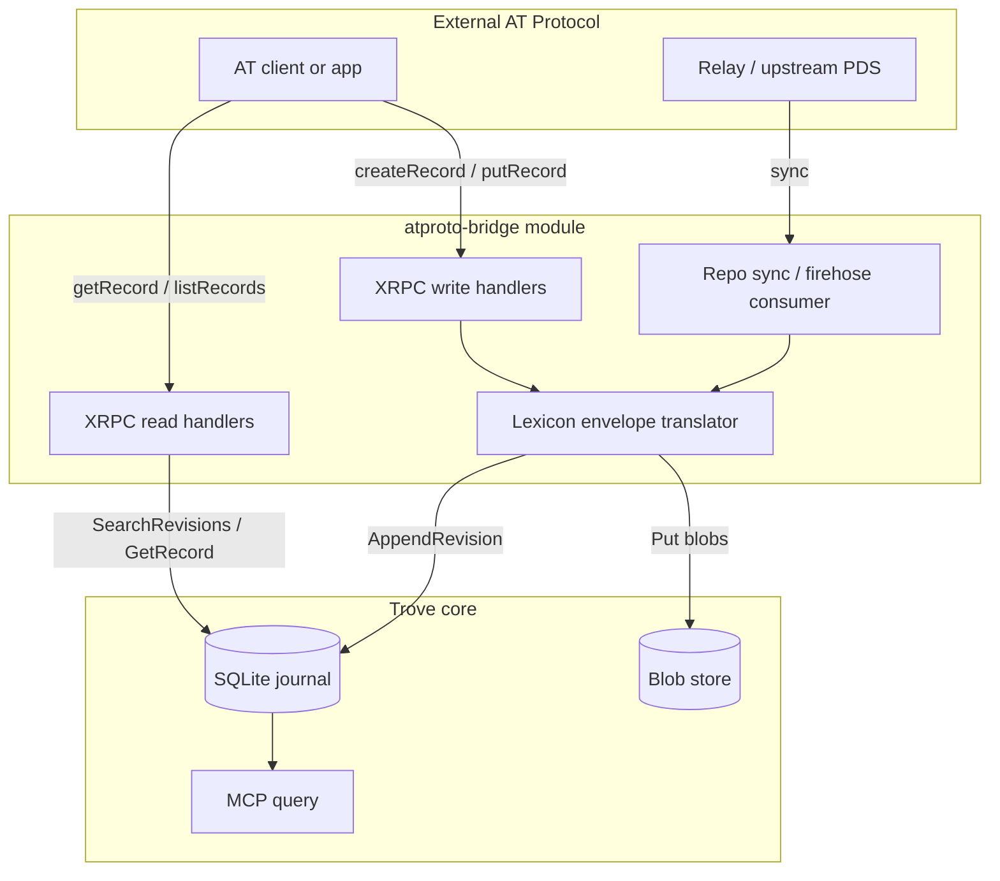

# AT Protocol bridge

**Status:** Planned\
**Milestone:** Later (post live-test)\
**Spec:** [Modules §8](../spec.md#8-module-architecture-dynamic-socket-based), [References](./references.md)\
**Package:** `modules/atproto-bridge`

## Goal

Provide a **translation layer** between AT Protocol and Trove — not a federated PDS.
Persist AT Protocol records into the Trove journal and serve them back through an
AT-shaped read/write API so existing atproto clients and tooling can interoperate
without Trove becoming a network participant.

Trove remains the canonical personal store. The bridge module:

1. **Ingests** AT Protocol records (sync and/or write API) → Trove revisions
2. **Serves** Trove-stored AT records back via a read-oriented XRPC surface
3. **Preserves** enough metadata (`at://` URI, collection, rkey, CID, DID) to round-trip

This is explicitly **not** federation: no relay hosting, no handle resolution service,
no multi-actor PDS. A configured DID/repo acts as the local translation namespace.

## Non-goals (for this module)

- Acting as a federated Personal Data Server on the AT network
- Multi-journal sync or cross-PDS reconciliation (see [non-goals](../non-goals.md))
- Replacing Trove's MCP query surface
- Hosting a global lexicon registry

## Architecture



## Canonical Trove representation

Store each AT record as one Trove record with a single envelope type:

| Field | Role |
|-------|------|
| `trove://type/atproto/record/stored/1` | Envelope type for all mirrored/written AT records |
| `source` | Configured repo DID (e.g. `did:plc:...`) |
| `references` | `at://` URIs for reply/thread/embed edges (`rel` optional) |
| Payload `collection` | Lexicon NSID (e.g. `app.bsky.feed.post`) |
| Payload `rkey` | Record key (TID or client-supplied) |
| Payload `at_uri` | Canonical `at://did/collection/rkey` |
| Payload `cid` | Content ID at last write (when known) |
| Payload `value` | Lexicon record JSON (the `$type` object) |
| Payload `rev` | AT repo revision string (when syncing from upstream) |

Blobs referenced by AT records (images, etc.) are stored via `core.Put` and linked
with `references` using `trove://blob/sha256-...` plus optional `at://` blob refs
when the upstream CID is known.

### Identity mapping

| AT Protocol | Trove |
|-------------|-------|
| `at://{did}/{collection}/{rkey}` | Stable external identity; indexed for lookup |
| Repo commit / MST | Not stored — replay from Trove revisions on serve-back |
| DID document / signing keys | Module config only (for verifying upstream sync) |
| `record_ref` | Trove ULID; map maintained in module projection or payload index |

On first ingest of an `at_uri`, allocate a new `record_ref`. Subsequent writes to the
same `(did, collection, rkey)` append `apply` revisions on that record (idempotent
by `at_uri`).

## Module shape

Single external module `modules/atproto-bridge/`:

```toml
name     = "atproto-bridge"
version  = "0.1.0"
kind     = "processor"   # HTTP routes; optional background sync in Run

provides = ["trove://type/atproto/record/stored/1"]

[[types]]
name    = "atproto.record.stored"
version = 1
schema  = "types/atproto.record.stored.ttd.json"

[[http.routes]]
method = "POST"
path   = "/xrpc/com.atproto.repo.createRecord"

[[http.routes]]
method = "POST"
path   = "/xrpc/com.atproto.repo.putRecord"

[[http.routes]]
method = "GET"
path   = "/xrpc/com.atproto.repo.getRecord"

[[http.routes]]
method = "GET"
path   = "/xrpc/com.atproto.repo.listRecords"

[[http.routes]]
method = "GET"
path   = "/xrpc/com.atproto.repo.describeRepo"
```

Module config (read by the binary, ignored by core parser):

```toml
[did]
repo = "did:plc:..."          # local translation namespace

[sync]
enabled = false               # phase 2
relay   = "wss://..."
cursor  = "/var/lib/trove/atproto-sync.cursor"

[auth]
# Reuse gateway bearer validator or AT-specific JWT — see open questions
validator = "module.http-gateway.bearer"
```

### Dependencies

Use [indigo](https://github.com/bluesky-social/indigo) for lexicon parsing, CID
computation, and record validation. Do not reimplement MST/CAR unless sync phase
requires it.

## Interfaces

### Phase 1 — Local write + read (recommended first)

| Direction | Endpoint | Behaviour |
|-----------|----------|-----------|
| Ingest | `POST .../repo.createRecord` | Validate lexicon → envelope → `AppendRevision` |
| Ingest | `POST .../repo.putRecord` | Upsert by `(collection, rkey)` |
| Serve | `GET .../repo.getRecord` | Lookup by `at_uri` index → return `{ uri, cid, value }` |
| Serve | `GET .../repo.listRecords` | Filter journal by `collection` + cursor |
| Serve | `GET .../repo.describeRepo` | Return configured DID + collection list from index |

Responses follow AT Protocol XRPC JSON shapes so off-the-shelf atproto clients can
read (and optionally write) against Trove's gateway port.

### Phase 2 — Upstream sync

| Direction | Mechanism | Behaviour |
|-----------|-----------|-----------|
| Ingest | `com.atproto.sync.subscribeRepos` or periodic `getRepo` | Stream/create revisions for records not yet in journal |
| State | Cursor file or blob | Resume after restart; at-least-once with `at_uri` dedupe |

Sync is **into** Trove only. The bridge does not push Trove-native records (notes,
MQTT events, etc.) onto the AT network unless explicitly written through the AT API.

### Phase 3 — Extended lexicon coverage

- Validate `value` against registered lexicons (start with `app.bsky.*` + `com.atproto.*`)
- Map blob uploads via `com.atproto.repo.uploadBlob` → Trove blob store
- Optional sink: mirror selected Trove-native types **out** to an upstream PDS

## Implementation notes

- **HTTP handler** pattern: follow `modules/mcp-query` — `HandleHTTP` on gateway routes,
  `RecordProjection` / `SearchRevisions` for reads, `AppendRevision` for writes.
- **Idempotency**: sync and at-least-once dispatch may replay; dedupe on `at_uri` +
  `cid` before append.
- **Deletes**: `com.atproto.repo.deleteRecord` → Trove `delete` operation on mapped
  `record_ref`.
- **Auth**: gate XRPC routes through existing gateway validators; AT repo writes must
  not be anonymously callable on a tailnet-exposed host.
- **MCP coexistence**: MCP continues to query all records; AT envelope records appear
  as typed events with lexicon JSON in `value`. Optional future MCP tool
  `get_atproto_record(uri)` is not required for v1.
- **Projections**: module-local SQLite table or in-memory index mapping
  `(did, collection, rkey) → record_ref` rebuilt from journal replay. Avoid core schema
  changes in v1.

## Acceptance criteria

### Phase 1

- [ ] `atproto-bridge` module builds via `make build`
- [ ] `createRecord` / `putRecord` persist envelope revisions with validated TTD
- [ ] `getRecord` returns round-tripped lexicon JSON for a written record
- [ ] `listRecords` paginates by collection
- [ ] `describeRepo` returns configured DID
- [ ] Duplicate `putRecord` for same rkey updates in place (new revision, same `record_ref`)
- [ ] Gateway auth enforced on write routes

### Phase 2

- [ ] Firehose or periodic sync ingests records from configured upstream
- [ ] Restart resumes from cursor without duplicate `at_uri` rows
- [ ] Blob refs from synced records land in Trove blob store

### Phase 3

- [ ] Lexicon validation rejects malformed `value` on write
- [ ] `uploadBlob` stores bytes and returns AT-shaped blob ref

## Dependencies

- **Blocked by:** HTTP gateway, records layer, type catalog, processors/sinks runtime
- **Blocks:** nothing in v0 milestone sequence

## Open questions

| Question | Options | Recommendation |
|----------|---------|----------------|
| Initial lexicon scope | `app.bsky.feed.post` only vs all `app.bsky.*` | Start with posts + profiles; expand by demand |
| Write authority | Trove-native only vs also proxy writes to upstream PDS | Trove-local writes in v1; upstream proxy is phase 3 sink |
| Identity model | Single configured DID vs multiple | Single DID — matches Trove single-user scope |
| Conflict policy | Upstream sync overwrites vs Trove wins | Last-write-wins on `cid`/`rev`; log conflicts |
| Auth for XRPC | Reuse bearer vs AT JWT | Reuse gateway bearer for v1 |
| Signing on serve-back | Return upstream CID vs recompute from Trove bytes | Recompute CID from stored `value` for local writes; preserve upstream CID on sync |

When resolved, move decisions to [open-items.md](../open-items.md).
