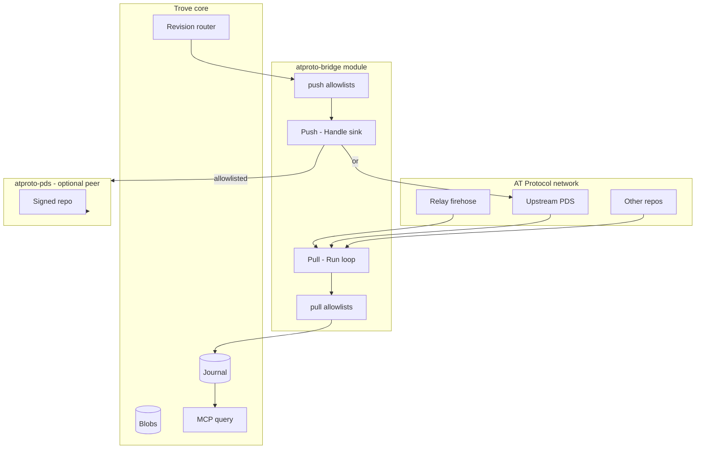
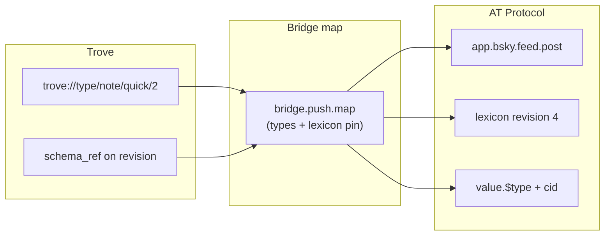
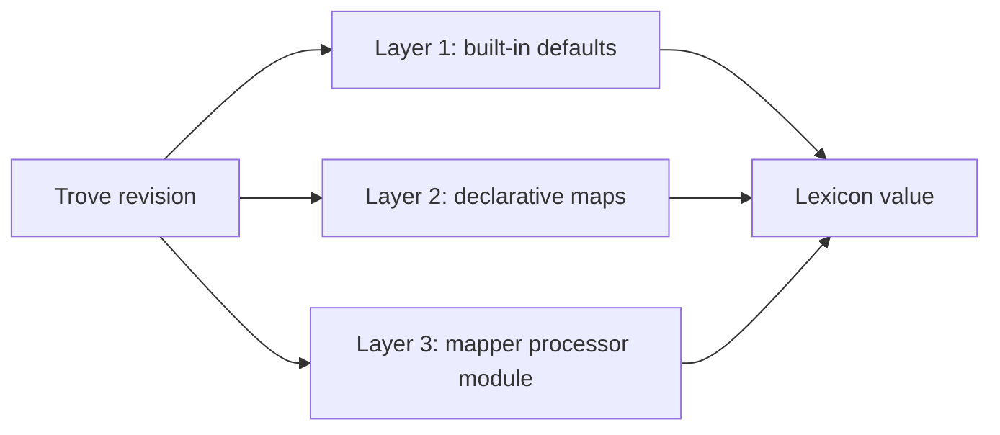

# AT Protocol bridge

**Status:** Planned\
**Milestone:** Later (post live-test)\
**Spec:** [Modules §8](../spec.md#8-module-architecture-dynamic-socket-based), [References](./references.md)\
**Package:** `modules/atproto-bridge`

## Goal

Bidirectional **bridge** between AT Protocol and the Trove life repo:

- **Pull** — ingest records from AT hosts (relay firehose, upstream repo sync, on-demand
  fetch) into the journal, filtered by wildcard allowlists
- **Push** — emit selected Trove revisions to AT Protocol (local [PDS](./atproto-pds.md) or
  upstream host), filtered by wildcard allowlists

The bridge does **not** replace `atproto-pds`. The PDS module owns your federated repo
(signing, firehose out, XRPC serve). The bridge owns **cross-boundary traffic** with
explicit, configurable filters on both sides.

## Architecture



| Direction | Module hook | Allowlist keys |
|-----------|-------------|----------------|
| Pull | `Run()` — firehose / sync / fetch loops | `repos`, `collections` |
| Push | `Handle()` — revision router sink | `types`, `collections` (target) |

## Canonical journal envelope

Pulled records and push confirmations both use one type:

```
trove://type/atproto/record/stored/1
```

| Field | Pull | Push |
|-------|------|------|
| `source` | Remote or own DID | Own DID |
| `payload.at_uri` | `at://{did}/{collection}/{rkey}` | Same after write |
| `payload.collection` | NSID | NSID |
| `payload.rkey` | From repo | Assigned on create |
| `payload.cid` | From repo | From write response |
| `payload.value` | Lexicon JSON (verbatim) | Lexicon JSON (translated from Trove body) |
| `payload.value_type` | `$type` from `value` | `$type` stamped on output |
| `payload.lexicon` | Collection NSID | Target collection NSID |
| `payload.lexicon_revision` | Revision at pull time (if known) | Revision validated against at push |
| `payload.trove_origin_type` | — | Source `trove://type/...` URI (incl. version) |
| `payload.trove_origin_schema_ref` | — | Source revision `schema_ref` |
| `payload.map_id` | — | Which `[[bridge.push.map]]` entry applied |
| `payload.direction` | `pulled` | `pushed` |
| `payload.origin` | `firehose` \| `sync` \| `fetch` | `sink` |
| `schema_ref` | Envelope TTD at write | Envelope TTD at write |

Dedupe on `(at_uri, cid)` for pulls; on `(trove_origin_record_ref, at_uri)` for push
confirmations.

## Schema and lexicon versioning

Trove and AT Protocol version schemas differently. The bridge must preserve **both**
sides at the boundary so historical records remain interpretable after upgrades.

### Two versioning systems

| System | Identity | Version signal | Breaking change |
|--------|----------|----------------|-----------------|
| **Trove** | `trove://type/{path}/{version}` | Integer suffix in URI; `supersedes` in TTD | Bump URI (`/1` → `/2`); old rows keep `schema_ref` |
| **AT lexicon** | NSID (e.g. `app.bsky.feed.post`) | Top-level `revision` on `com.atproto.lexicon.schema` | Breaking → new NSID (`…V2`); non-breaking → `revision++` |
| **AT record** | `at://{did}/{collection}/{rkey}` | Immutable once written | New shape → new rkey or new collection NSID |

Trove **record `version`** (monotonic per `record_ref`) is unrelated — it tracks fold
history, not schema contract version.



### Rules

1. **Mappings are version-specific.** `[[bridge.push.map]].types` matches full Trove
   URIs or globs — prefer exact version (`…/quick/1`) when shapes differ; use `/*` only
   when all versions share the same field map.

2. **Store provenance on every envelope.** `trove_origin_type`, `trove_origin_schema_ref`,
   `lexicon`, `lexicon_revision`, and `value_type` let you answer "what contract produced
   this?" years later — parallel to Trove's `schema_ref` for native types.

3. **Pull: preserve bytes, don't upgrade.** Ingest `value` verbatim. Do not re-validate
   pulled records against a newer lexicon revision on read. Optional lenient validation
   at ingest only (warn, don't mutate).

4. **Push: validate against pinned lexicon.** Each map entry names target `lexicon`
   (NSID). Bridge resolves the lexicon catalog entry (bundled or fetched) and validates
   output before `createRecord`. Pin `lexicon_revision` when reproducibility matters;
   default `latest` uses highest known revision.

5. **Lexicon catalog in the bridge module.** Maintain a local catalog (like Trove's type
   catalog): bundled `app.bsky.*` + `com.atproto.*`, plus fetched
   `com.atproto.lexicon.schema` records with monotonic `revision`. Track
   `lexicon_ref` (content hash of lexicon JSON) alongside `revision` number.

6. **TTD envelope evolution.** When `atproto/record/stored` gains required fields, bump
   to `trove://type/atproto/record/stored/2`. Old envelopes remain valid via their
   `schema_ref`.

### Map config with versions

```toml
[[bridge.push.map]]
id = "note-quick-v1-to-bsky-post"          # stored in payload.map_id
types = ["trove://type/note/quick/1"]        # Trove schema version pinned
collection = "app.bsky.feed.post"
lexicon = "app.bsky.feed.post"
lexicon_revision = "latest"                # or pinned: 4

[bridge.push.map.fields]
"$type" = "app.bsky.feed.post"
text    = "$.body.text"

[[bridge.push.map]]
id = "note-quick-v2-to-bsky-post"
types = ["trove://type/note/quick/2"]        # new map when Trove type bumps
supersedes = ["note-quick-v1-to-bsky-post"]  # migration hint (documentation)
collection = "app.bsky.feed.post"
lexicon = "app.bsky.feed.post"

[bridge.push.map.fields]
"$type" = "app.bsky.feed.post"
text    = "$.body.text"
facets  = "$.body.facets"                  # new field in v2 only
```

Pull maps key on **collection** (+ optional lexicon revision range):

```toml
[[bridge.pull.map]]
collections = ["app.bsky.feed.post"]
lexicon = "app.bsky.feed.post"
# lexicon_revision = "*"                  # any revision (default)
# Store value as-is; lexicon_revision captured from catalog at pull time
```

### Lexicon breaking changes

When AT designers mint a new NSID (`app.bsky.feed.postV2`):

- Add new `[[bridge.push.map]]` / allowlist entry for the new collection
- Keep old map for records still targeting v1 NSID
- Pull allowlist adds new collection pattern
- Do **not** mutate stored envelopes — old `at_uri` + `cid` pairs are immutable history

When Trove bumps `trove://type/note/quick/2`:

- Register new TTD in type catalog (`supersedes` → v1 URI)
- Add new push map keyed to `/2`
- Existing journal rows keep `schema_ref` pointing at v1 TTD bytes

### Layer 3 mapper modules and versions

Mapper processors should declare `provides` with a versioned draft type:

```toml
provides = ["trove://type/atproto/record/draft/1"]

[[types]]
name = "atproto.record.draft"
version = 1
```

Draft payload carries explicit version metadata for the bridge:

```json
{
  "collection": "app.bsky.feed.post",
  "lexicon": "app.bsky.feed.post",
  "lexicon_revision": 4,
  "value": { "$type": "app.bsky.feed.post", "text": "..." },
  "trove_origin_type": "trove://type/note/quick/2"
}
```

Bump draft type URI when the draft contract changes.

### Compatibility checks (push path)

Before `createRecord`:

1. Resolve `lexicon` → catalog entry at `lexicon_revision` (or latest)
2. Validate mapped `value` against lexicon (strict at write time)
3. On failure: reject push, log map id + both version signals; do not partially write
4. Optional: `check_compatibility` when user updates bundled lexicons (startup warning)


## Allowlists

Both sides use **glob patterns** (Go `path.Match` semantics, same spirit as manifest
`consumes` / `provides`). Empty list = deny all (fail closed). No bare `*`.

### Pull allowlists

Filter **before** `AppendRevision`.

```toml
[bridge.pull]
# Whose repos to accept (DID globs)
repos = [
  "did:plc:myself",              # exact
  "did:plc:followed-*",          # glob
]

# Which lexicon collections (NSID globs)
collections = [
  "app.bsky.feed.post",
  "app.bsky.actor.profile",
  "app.bsky.graph.*",
]

# Optional: deny overrides (evaluated after allow; first match wins deny)
# deny_repos = []
# deny_collections = ["app.bsky.graph.block"]
```

| Pattern example | Matches |
|-----------------|---------|
| `did:plc:abc123` | Exact DID |
| `did:plc:followed-*` | DID prefix glob |
| `app.bsky.feed.post` | Exact NSID |
| `app.bsky.graph.*` | `app.bsky.graph.follow`, `app.bsky.graph.block`, … |
| `app.bsky.*` | Any `app.bsky` collection |

**Pull sources** (independent toggles):

```toml
[bridge.pull.firehose]
enabled = true
relay = "wss://bsky.network/xrpc/com.atproto.sync.subscribeRepos"
cursor = "/var/lib/trove/atproto-bridge-firehose.cursor"

[bridge.pull.sync]
enabled = false
repos = ["did:plc:myself"]        # periodic getRepo from each
pds_hosts = ["https://bsky.social"]
interval = "1h"

[bridge.pull.fetch]
enabled = true                    # on-demand when Trove references at://...
```

Firehose delivers all network commits — **allowlists are mandatory** to avoid filling
the journal with the entire relay stream.

### Push allowlists

Filter in `Handle()` **before** AT write.

```toml
[bridge.push]
# Which Trove revision types may be pushed (trove:// globs)
types = [
  "trove://type/note/*",
  "trove://type/shortcuts/share/saved/1",
]

# Only these journal operations (default: apply only)
operations = ["apply"]

# Target AT collection per type (first matching glob wins)
[[bridge.push.map]]
types = ["trove://type/note/*"]
collection = "app.bsky.feed.post"

[[bridge.push.map]]
types = ["trove://type/shortcuts/share/saved/1"]
collection = "app.bsky.feed.post"

# Fallback when no map entry matches
default_collection = "app.bsky.feed.post"

# Optional deny
# deny_types = ["trove://type/mqtt/*"]
```

Manifest `consumes` must be a **superset** of `bridge.push.types` so the revision router
delivers matching revisions:

```toml
name     = "atproto-bridge"
version  = "0.1.0"
kind     = "processor"
consumes = ["trove://type/note/*", "trove://type/shortcuts/share/saved/1"]
provides = ["trove://type/atproto/record/stored/1"]
```

### Push target

```toml
[bridge.push.target]
# "local" — write via atproto-pds repo (recommended)
# "upstream" — XRPC to external PDS with configured session
mode = "local"

[bridge.push.target.local]
# in-process repo handle or RPC to sibling module

[bridge.push.target.upstream]
pds_url = "https://bsky.social"
# session via app password or OAuth token file — see open questions
```

## Module shape

```toml
name     = "atproto-bridge"
version  = "0.1.0"
kind     = "processor"

consumes = ["trove://type/note/*", "trove://type/shortcuts/*"]
provides = ["trove://type/atproto/record/stored/1"]

[[types]]
name    = "atproto.record.stored"
version = 1
schema  = "types/atproto.record.stored.ttd.json"
```

No `[[http.routes]]` — the bridge is a router participant, not an XRPC server. HTTP
surface stays on [atproto-pds](./atproto-pds.md) when federation is needed.

## Pull paths (detail)

### Firehose

1. WebSocket `com.atproto.sync.subscribeRepos` on configured relay
2. For each commit op: extract `(did, collection, rkey)`
3. Match `repos` + `collections` allowlists → skip if no match
4. Fetch full record if needed (`getRecord`) → translate to envelope → `AppendRevision`
5. Persist cursor; resume on restart (at-least-once; dedupe on `(at_uri, cid)`)

### Repo sync

1. On interval (or startup): `com.atproto.sync.getRepo` per `pull.sync.repos`
2. Walk CAR / commit ops; same allowlist filter
3. Useful for **migration** and backfill without live firehose

### On-demand fetch

1. When a Trove revision references an `at://` URI (link, embed, manual capture)
2. If not already in journal index → `getRecord` from resolved PDS
3. Same allowlist filter — external refs to non-allowlisted repos are not pulled

## Push paths (detail)

### Mapping (Trove ↔ AT)

There is **no mapping-function registry in Trove core today**. Cross-schema translation
is handled in three layers (simple → powerful):



#### Layer 1 — Built-in defaults

Shipped in `atproto-bridge` for common pairs:

| Trove type | AT collection | Mapping |
|------------|---------------|---------|
| `trove://type/note/quick/1` | `app.bsky.feed.post` | `text` ← `body.text` |
| `trove://type/shortcuts/share/saved/1` | `app.bsky.feed.post` | `text` + embed from `url` |

#### Layer 2 — Declarative field maps (config)

For push and pull without writing Go. Each `[[bridge.push.map]]` or
`[[bridge.pull.map]]` entry matches type/collection globs and declares field paths.

```toml
[[bridge.push.map]]
id = "note-any-to-bsky-post"
types = ["trove://type/note/*"]              # glob — only when all versions share shape
collection = "app.bsky.feed.post"
lexicon = "app.bsky.feed.post"

[bridge.push.map.fields]
"$type" = "app.bsky.feed.post"                    # constant
text    = "$.body.text"                           # JSONPath from revision body
createdAt = "$.time"                              # RFC3339 from revision time
langs   = "$.body.langs"                          # optional array

[[bridge.push.map]]
types = ["trove://type/shortcuts/share/saved/1"]
collection = "app.bsky.feed.post"

[bridge.push.map.fields]
"$type" = "app.bsky.feed.post"
text    = "$.body.title"
"embed.external.uri" = "$.body.url"
"embed.external.title" = "$.body.title"
```

Pull inverse example:

```toml
[[bridge.pull.map]]
collections = ["app.bsky.feed.post"]

[bridge.pull.map.fields]
"value.text" = "$.text"                           # from lexicon record
```

**Expression syntax (planned):**

| Form | Meaning |
|------|---------|
| `"literal"` | Constant string |
| `$.body.field` | JSONPath into folded record body |
| `$.time`, `$.record_ref` | JSONPath into revision metadata |
| `$.refs.reply` | Resolved `at://` from `references` with `rel: reply` |

Validation: mapped output must pass target lexicon validation before push; pull maps
run after allowlist filter.

#### Layer 3 — Mapper processor modules (custom logic)

For transforms declarative maps cannot express, use a **separate processor module**
that sits *before* the bridge in the revision graph:

```toml
# modules/my-atproto-maps/manifest.toml
name     = "my-atproto-maps"
kind     = "processor"
consumes = ["trove://type/note/*"]
provides = ["trove://type/atproto/record/draft/1"]
```

```go
// Process(revision) -> []*Revision with pre-built lexicon value in payload
func (m *mapper) Process(ctx context.Context, rev *Revision, dc *DispatchContext) ([]*Revision, error) {
    // arbitrary Go: trim text, merge fields, attach blobs, call external API, etc.
}
```

Bridge push allowlist then targets the draft type:

```toml
[bridge.push]
types = ["trove://type/atproto/record/draft/1"]

[[bridge.push.map]]
types = ["trove://type/atproto/record/draft/1"]
collection = "$.payload.collection"   # draft carries target collection
# fields pass through: value = "$.payload.value"
```

This reuses Trove's existing **processor** contract (`Process` → derived revisions)
— no new plugin ABI. Multiple mapper modules can chain (watch `seen` / loop prevention).

**Not** revision `transforms` (RFC 6902 JSON Patch): those patch the *same* record body
during fold, not cross-schema AT translation.

#### Choosing a layer

| Need | Use |
|------|-----|
| Standard note → post | Layer 1 built-in |
| Tweaked field paths, constants | Layer 2 declarative map |
| Conditional logic, LLM enrichment, multi-record fan-out | Layer 3 processor module |
| User-defined scripts (JS/WASM) | Out of scope — use layer 3 Go module |

### Write + confirm

1. `Handle(revision)` — check `types`, `operations` allowlists
2. Translate body → lexicon `value`
3. `createRecord` / `putRecord` on push target
4. Append confirmation envelope with `direction: pushed`, `trove_origin` reference
5. Idempotent: if `(record_ref, collection)` already pushed with same body hash, skip

### Loop prevention

Push confirmation envelopes use `provides` type `atproto/record/stored` — ensure
`consumes` does **not** match that type, or push filter excludes
`payload.direction == pushed`.

## Relationship to `atproto-pds`

| Concern | Owner |
|---------|-------|
| Signing, DID, MST, XRPC serve, firehose **out** | `atproto-pds` |
| Pull from network, push from Trove, allowlists | `atproto-bridge` |
| Journal mirror of AT records | Both may append envelopes; dedupe on `at_uri` |

Typical deployment: run **both** modules. Bridge `push.target.mode = local` writes into
the PDS repo; PDS mirrors to journal; bridge pull also appends external records the PDS
does not own.

## Implementation phases

### Phase 1 — Push with allowlists

- Processor sink: `Handle()` + `bridge.push.types` filtering
- Layer 1 built-in maps + Layer 2 declarative `[[bridge.push.map]]`
- Write to local PDS or upstream XRPC
- Confirmation envelope in journal

### Phase 2 — Pull with allowlists

- `Run()` firehose consumer + cursor
- `repos` + `collections` filters
- Envelope append + blob fetch for embeds

### Phase 3 — Sync + fetch

- Periodic `getRepo` backfill
- On-demand fetch for referenced `at://` URIs
- Deny lists, per-type push maps, metrics/healthcheck

## Acceptance criteria

### Phase 1 (push)

- [ ] `bridge.push.types` globs filter revisions; non-matching skipped
- [ ] Allowlisted note creates `app.bsky.feed.post` on target
- [ ] Envelope stores `trove_origin_type`, `lexicon`, `lexicon_revision`, `map_id`
- [ ] Push validates against pinned/latest lexicon revision
- [ ] Confirmation envelope in journal with `trove_origin` reference
- [ ] Re-delivery of same revision does not duplicate AT record
- [ ] `operations = ["apply"]` excludes deletes
- [ ] Version-specific maps: `trove://type/note/quick/1` vs `/2` route to correct fields

### Phase 2 (pull)

- [ ] Firehose cursor resumes without duplicate envelopes
- [ ] `repos` + `collections` allowlists enforced; out-of-scope commits ignored
- [ ] Pulled records stored verbatim with captured `lexicon_revision`
- [ ] Pulled post searchable via MCP alongside Trove-native records
- [ ] Empty allowlist denies all (fail closed)

### Phase 3

- [ ] `getRepo` sync backfills allowlisted records
- [ ] On-demand fetch for referenced `at://` when allowlisted
- [ ] `deny_*` overrides work
- [ ] Lexicon catalog fetch + startup compatibility warnings
- [ ] New NSID (`…V2`) handled via separate map entries without mutating history

## Dependencies

- **Blocked by:** records layer, revision router, type catalog, blob store
- **Soft:** [atproto-pds](./atproto-pds.md) for `push.target.mode = local` and federation
- **External:** indigo client libraries for XRPC + CAR/firehose parsing
- **Blocks:** nothing in v0 milestone sequence

## Open questions

| Question | Recommendation |
|----------|----------------|
| One module vs split ingest/emit | Single `atproto-bridge` processor |
| Allowlist in manifest vs config only | Config for pull/push lists; manifest `consumes` mirrors push types |
| NSID glob implementation | Reuse `path.Match`; document examples in getting-started |
| Field map expression language | JSONPath v1; constants + `$.body.*` / `$.time` |
| Draft type for layer-3 mappers | `trove://type/atproto/record/draft/1` with `{collection, value, lexicon_revision}` |
| Lexicon catalog source | Bundled `app.bsky.*` + fetch `com.atproto.lexicon.schema` at startup |
| `lexicon_revision` pin vs latest | Pin for reproducible push; latest default; always store actual revision on envelope |
| Envelope type bump | `atproto/record/stored/2` when required fields added; v1 rows keep `schema_ref` |
| Upstream push auth | App password file for v1; OAuth later |
| Pull blob media | Fetch via `getBlob` → `core.Put` when record references blobs |

When resolved, move decisions to [open-items.md](../open-items.md).

## See also

- [AT Protocol PDS module](./atproto-pds.md) — federated repo host (peer, not replacement)
- [Processors and sinks](./processors-sinks.md) — revision routing
- [References](./references.md) — `at://` and `trove://` edges
