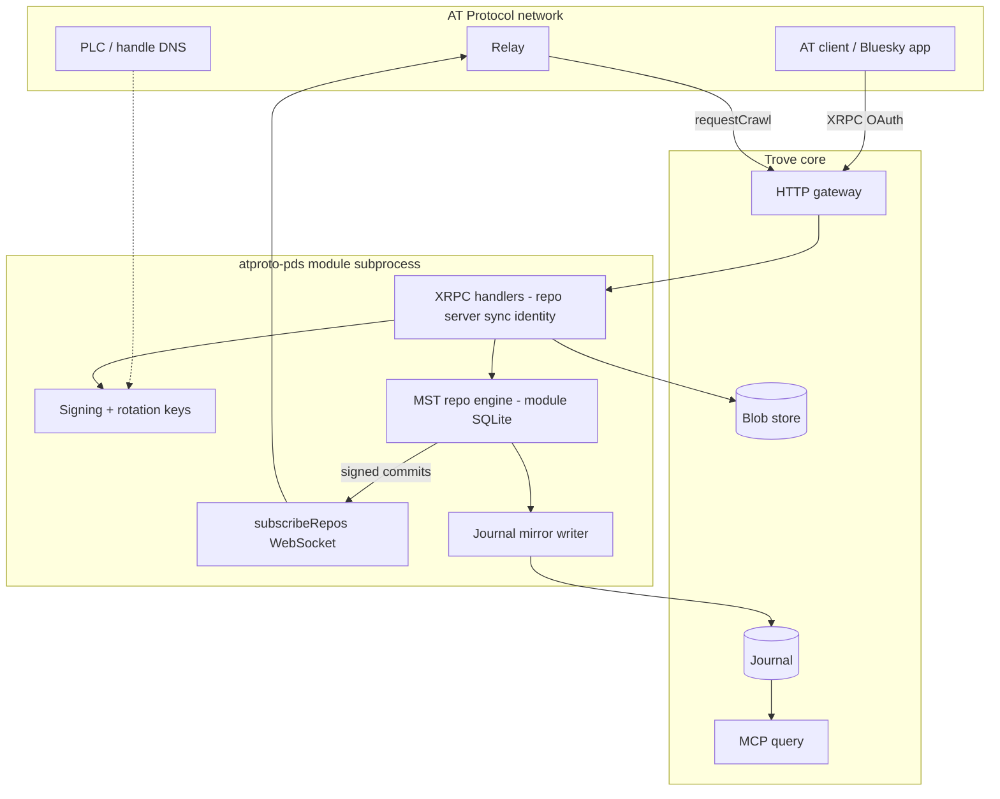

# AT Protocol PDS module

**Status:** Planned\
**Milestone:** Later (post live-test)\
**Spec:** [Modules §8](../spec.md#8-module-architecture-dynamic-socket-based), [References](./references.md)\
**Package:** `modules/atproto-pds`

## Goal

Implement a **single-user federated Personal Data Server** as a Trove module. Trove
core stays a personal event journal; the `atproto-pds` module owns AT Protocol
identity, signing, repository storage, XRPC, and federation — including the
WebSocket firehose relays need to pick up new commits.

This is the preferred integration path for AT Protocol in Trove: not a core
rewrite, not a non-federated translation shim, but a module that **is** the PDS
for one configured DID while optionally mirroring records into the Trove journal
so MCP and other Trove sources remain searchable in one place.

## Design principles

| Principle | Detail |
|-----------|--------|
| **Module owns the PDS** | Signing keys, DID, MST/repo engine, lexicon validation, OAuth/sessions live in the module subprocess |
| **Single user** | One configured `did:plc:...` — matches Trove's single-user scope |
| **Federation in scope** | Signed commits, `subscribeRepos` WebSocket firehose, relay crawl, CAR export |
| **Trove journal is optional mirror** | Repo engine is canonical for AT; journal mirror enables MCP/unified search |
| **Reuse indigo** | Repo engine, CID/MST, lexicons, XRPC shapes — do not hand-roll cryptography |
| **WebSocket is required** | Firehose is not optional for network-visible posts; gateway or module must serve it |

## Non-goals

- Multi-account PDS hosting (hundreds of DIDs) — out of Trove's single-user scope
- Replacing Trove MCP as the primary local query surface
- Multi-journal sync between Trove instances (see [non-goals](../non-goals.md))
- Hosting a global lexicon registry service

## Architecture



### Storage split

| Store | Owner | Contents |
|-------|-------|----------|
| Module SQLite | `atproto-pds` | MST, commit log, account/session metadata, sequencer cursor |
| Trove journal | Core (via mirror) | `trove://type/atproto/record/stored/1` envelopes for MCP search |
| Trove blobs | Core | Binary media; module uses `core.Put` / `BlobGet` |

The **repo engine is canonical** for AT Protocol (signed `rev`/`cid` chain). The
journal mirror is a derived projection — rebuildable from repo export if needed.

## Module shape

```toml
name     = "atproto-pds"
version  = "0.1.0"
kind     = "processor"

provides = ["trove://type/atproto/record/stored/1"]

[[types]]
name    = "atproto.record.stored"
version = 1
schema  = "types/atproto.record.stored.ttd.json"

# Repo + server (gateway unary HTTP)
[[http.routes]]
method = "POST"
path   = "/xrpc/com.atproto.repo.createRecord"

[[http.routes]]
method = "POST"
path   = "/xrpc/com.atproto.repo.putRecord"

[[http.routes]]
method = "POST"
path   = "/xrpc/com.atproto.repo.deleteRecord"

[[http.routes]]
method = "POST"
path   = "/xrpc/com.atproto.repo.applyWrites"

[[http.routes]]
method = "POST"
path   = "/xrpc/com.atproto.repo.uploadBlob"

[[http.routes]]
method = "GET"
path   = "/xrpc/com.atproto.repo.getRecord"

[[http.routes]]
method = "GET"
path   = "/xrpc/com.atproto.repo.listRecords"

[[http.routes]]
method = "GET"
path   = "/xrpc/com.atproto.repo.describeRepo"

[[http.routes]]
method = "GET"
path   = "/xrpc/com.atproto.sync.getRepo"

[[http.routes]]
method = "GET"
path   = "/xrpc/com.atproto.sync.listRepos"

[[http.routes]]
method = "POST"
path   = "/xrpc/com.atproto.sync.requestCrawl"

# Firehose — WebSocket upgrade (see Transport)
[[http.routes]]
method = "GET"
path   = "/xrpc/com.atproto.sync.subscribeRepos"
transport = "websocket"

# Identity + sessions (subset for single-user)
[[http.routes]]
method = "POST"
path   = "/xrpc/com.atproto.server.createSession"

[[http.routes]]
method = "POST"
path   = "/xrpc/com.atproto.server.refreshSession"

[[http.routes]]
method = "GET"
path   = "/xrpc/com.atproto.server.describeServer"

[[http.routes]]
method = "GET"
path   = "/xrpc/_health"
```

Module config (read by the binary):

```toml
[pds]
repo_path = "/var/lib/trove/atproto-repo.db"
hostname  = "pds.example.com"       # public host for handle + federation

[did]
repo    = "did:plc:..."
handle  = "you.example.com"
# signing_key_path, plc_rotation_key_path — or generate on first run

[mirror]
enabled = true                      # mirror writes into Trove journal

[federation]
relay_url = "https://bsky.network"
# sequencer persists cursor in repo_path DB

[auth]
# OAuth 2.0 + app passwords for AT clients; see open questions
```

## Transport: WebSocket firehose

Relays consume repo updates via `com.atproto.sync.subscribeRepos` over WebSocket.
This is required for federated visibility — unary HTTP XRPC alone is insufficient.

### Preferred: gateway WebSocket upgrade

Extend the HTTP gateway so routes can declare `transport = "websocket"`. The
gateway performs the upgrade and proxies frames to the module (bidirectional
stream over go-plugin gRPC v2, or a long-lived connection owned by the module).

Benefits: single `[http].listen` port, TLS terminates once, matches official PDS
deployment shape (`wss://host/xrpc/com.atproto.sync.subscribeRepos`).

Track in [http-gateway](./http-gateway.md) open questions — resolve "WebSocket
upgrade routes: Defer" in favour of supporting this module.

### Bootstrap alternative: module sidecar listener

Until gateway WebSocket lands, the module may bind a dedicated `wss` listener
(configured separately). Document clearly in deployment guides; migrate to
gateway routes when available.

## Implementation phases

### Phase 1 — Repo + local XRPC (no federation yet)

Prove the module can be a PDS for one DID on localhost:

- Embed indigo (or equivalent) repo engine in module-local SQLite
- Generate/load signing keys; configure DID (existing or provision via PLC)
- Implement `createRecord`, `putRecord`, `deleteRecord`, `getRecord`,
  `listRecords`, `describeRepo`, `uploadBlob`
- Lexicon validation for `app.bsky.feed.post` + `app.bsky.actor.profile` minimum
- Optional journal mirror on each commit
- `GET /xrpc/_health`

**Validates:** Bluesky-shaped clients can read/write against Trove's gateway port
for one repo, with correct CIDs and signed commits in module storage.

### Phase 2 — Federation

Make the network see the PDS:

- Durable sequencer + `subscribeRepos` WebSocket firehose
- `sync.getRepo`, `sync.listRepos`, `sync.requestCrawl`
- CAR export/import for migration
- Public hostname, TLS, handle DNS → DID resolution
- Relay crawl succeeds; test post appears via relay firehose

**Validates:** Self-hosted PDS federates like the official Bluesky PDS container.

### Phase 3 — Client auth + polish

- OAuth 2.0 / DPoP (or app passwords for v1 shortcut)
- `server.createSession`, `refreshSession`, `describeServer`
- Blob GC, moderation hooks, broader lexicon coverage
- MCP tool `get_atproto_record(uri)` optional convenience

## Journal mirror envelope

When `[mirror].enabled`, each repo commit also appends a Trove revision:

| Field | Value |
|-------|-------|
| `type` | `trove://type/atproto/record/stored/1` |
| `source` | Configured DID |
| `payload.collection` | NSID |
| `payload.rkey` | Record key |
| `payload.at_uri` | `at://{did}/{collection}/{rkey}` |
| `payload.cid` | Record CID from repo engine |
| `payload.rev` | Repo revision at write |
| `payload.value` | Lexicon record JSON |
| `references` | `at://` edges (reply, embed) |

Mirror writes are idempotent on `(at_uri, cid)`. MCP `search_records` can query
AT data alongside MQTT notes and shortcuts without implementing full XRPC in MCP.

## Implementation notes

- **Do not** store the MST in the Trove journal — only mirrored envelopes and blobs
- **Signing** happens entirely in the module before commit; Trove core never signs
- **Blob uploads**: `uploadBlob` → `core.Put` → store AT blob ref in repo record
- **Auth**: AT OAuth on XRPC routes; Trove bearer auth remains for `/records` and
  `/mcp` — two auth domains on one gateway port is acceptable
- **Idempotency**: repo engine handles commit semantics; mirror tolerates replay
- **Operational**: federation requires public `443`/`80`, valid TLS, and correct
  handle DNS — document in a getting-started page when phase 2 lands

### Core changes (minimal)

| Change | Why |
|--------|-----|
| Gateway WebSocket upgrade | Firehose on same port as XRPC |
| Optional `transport = "websocket"` in manifest | Route declaration |
| Possibly gRPC streaming for WS frames | Module subprocess boundary |

No changes to journal schema, type catalog, or MCP core.

## Acceptance criteria

### Phase 1

- [ ] `atproto-pds` module builds via `make build`
- [ ] Signing keys load or generate; DID configured
- [ ] `createRecord` / `putRecord` produce signed commits with valid CIDs
- [ ] `getRecord` / `listRecords` round-trip lexicon JSON
- [ ] `uploadBlob` stores in Trove blob store and references in repo
- [ ] Journal mirror appends envelope revisions when enabled
- [ ] `GET /xrpc/_health` returns version JSON

### Phase 2

- [ ] `subscribeRepos` WebSocket streams commit events after writes
- [ ] Relay crawl picks up repo; post visible on network firehose
- [ ] `sync.getRepo` exports CAR matching module repo
- [ ] Restart preserves sequencer cursor; no duplicate firehose events
- [ ] Handle resolves to configured DID

### Phase 3

- [ ] AT client login (OAuth or app password) against module
- [ ] Official Bluesky app can post via self-hosted PDS (stretch goal)

## Dependencies

- **Blocked by:** HTTP gateway, records layer, type catalog, blob store
- **Soft blocker:** Gateway WebSocket support (or accept sidecar for phase 2 bootstrap)
- **External:** [indigo](https://github.com/bluesky-social/indigo) or focused subset of its repo/XRPC packages
- **Blocks:** nothing in v0 milestone sequence

## Open questions

| Question | Recommendation |
|----------|----------------|
| indigo import depth | Use repo + xrpc packages; avoid pulling entire social app stack |
| WebSocket: gateway vs sidecar | Gateway upgrade preferred; sidecar acceptable for phase 2 bootstrap |
| OAuth vs app-password v1 | App passwords first for faster validation; OAuth before "Bluesky app" goal |
| Handle provisioning | Document manual PLC + DNS; automated provisioning later |
| Mirror default | `enabled = true` — unified MCP search is a key Trove benefit |
| Upstream PDS migration | `sync.getRepo` import from existing PDS on first setup |

When resolved, move decisions to [open-items.md](../open-items.md).

## Supersedes

Replaces the earlier non-federated [AT Protocol bridge](./atproto-bridge.md) direction.
That doc is retained only as a redirect stub.
