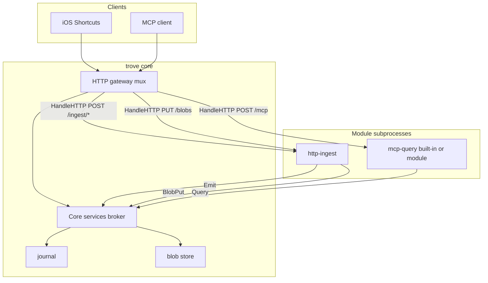

# HTTP gateway

**Status:** Supported\
**Milestone:** After two-week live test\
**Spec:** [Module architecture §8](../spec.md#8-module-architecture-dynamic-socket-based), [Query §9](../spec.md#9-query-interface-mcp-over-rpc), [Configuration §10](../spec.md#10-configuration)\
**Package:** `internal/gateway` (new), `internal/modules`, `internal/query`, `modules/http-ingest`

## Goal

Unify Trove's HTTP surfaces behind a **single core listener** with **declarative
route registration**. Today capture (`POST /ingest`, `PUT /blobs`) and query
(MCP streamable HTTP) are implemented as separate servers on different ports and
config files. This milestone makes them the same kind of thing: modules (or
built-ins) that register routes on a shared gateway, with core owning durable
services (journal, blobs) via symmetric RPC.

Primary outcomes:

1. One client-facing URL for iOS Shortcuts, MCP clients, and webhooks.
2. Manifest-declared routes instead of hardcoded muxes scattered across core and
   modules.
3. MCP and HTTP ingest follow the same extension pattern.
4. Gateway-level auth middleware (see [auth](./auth.md)) applies once.

## Problem statement (current state)

| Surface | Process | Config | Routes |
|---------|---------|--------|--------|
| HTTP ingest + blobs | `http-ingest` subprocess | `modules/http-ingest/manifest.toml` `listen` | Hardcoded in `server.go` |
| MCP query | `trove` core built-in | `trove.toml` `[mcp].listen` | Hardcoded in `internal/query/mcp.go` |

Pain points:

- Two ports and two listen settings for phone capture + MCP.
- `http-ingest` opens its own `http.Server`; core cannot compose routes.
- Blob path passed via `TROVE_BLOBS_PATH` env — core validates config but module
  owns the store handle (split authority).
- Adding a new HTTP capability (web dashboard, webhook sink) has no uniform path.
- Auth must be duplicated or proxied if surfaces stay split.

## Target architecture



**Principles:**

- Core owns the **only** `http.Server` on `[http].listen`.
- Modules **do not** call `ListenAndServe` for Trove-facing routes.
- Modules declare routes in `manifest.toml`; core dispatches matching requests via
  `HandleHTTP` RPC.
- Core exposes **service RPCs** to modules (symmetric with today's `Emit`):
  journal append, blob put/get, query API.
- Long-running sources without HTTP (MQTT) keep today's `Run` + `Emit` model.

## Interfaces

### Core config

Replace separate `[mcp].listen` and per-module `listen` with a single gateway
section. Migration period may accept both with deprecation warnings.

```toml
[http]
listen = ":8080"

# Optional global limits; per-route overrides in manifest.
max_body_bytes = 10485760
```

`[mcp]` may remain as logical grouping for MCP-specific settings (tool names,
timeouts) but not a separate listen address once gateway lands.

### Manifest route declaration

New `[[http.routes]]` table in module `manifest.toml`:

```toml
name     = "http-ingest"
version  = "1.0"
kind     = "source"
provides = ["http.ingest.received", "note.*", "shortcut.*"]

[[http.routes]]
method = "POST"
path   = "/ingest/{source}"

[[http.routes]]
method = "PUT"
path   = "/blobs"
max_body_bytes = 10485760  # optional override
```

Example MCP module (built-in or external):

```toml
name = "mcp-query"
version = "1.0"
kind = "source"  # or new kind "http" — see open questions

[[http.routes]]
method = "POST"
path   = "/mcp"
```

Route matching uses Go 1.22+ `ServeMux` patterns (`{name}` path segments).
Conflicting method+path across modules is a **startup error**.

### Module RPC — inbound HTTP

Extend `api/proto/trove/v1/module.proto`:

```protobuf
message HTTPRequest {
  string method = 1;
  string path = 2;           // matched path pattern, e.g. /ingest/{source}
  map<string, string> path_values = 3;
  map<string, string> headers = 4;
  bytes body = 5;
}

message HTTPResponse {
  int32 status = 1;
  map<string, string> headers = 2;
  bytes body = 3;
}

service HTTPModule {
  rpc HandleHTTP(HTTPRequest) returns (HTTPResponse);
}
```

`SourceModule.Run` gains a **service broker id** (like today's `ingest_broker_id`)
so handlers can call core services during request processing.

**v0 gateway scope:** unary request/response per HTTP call. Streaming (large blob
upload, MCP streamable HTTP chunking) may require a follow-up streaming RPC —
see open questions.

### Core service RPC — outbound from modules

Today modules only receive `Emit`. Gateway modules also need:

```protobuf
service CoreServices {
  rpc Emit(Event) returns (EmitResponse);
  rpc BlobPut(BlobPutRequest) returns (BlobPutResponse);
  rpc SearchEvents(...) returns (...);
  rpc GetEvent(...) returns (...);
  // etc. — mirror internal/query.Service
}
```

Go-side, `internal/query.Service` and `internal/blob.Store` remain in-process;
the broker is a thin gRPC adapter in the core host plugin set.

### Gateway router (core)

```go
// Conceptual — package internal/gateway
type Route struct {
    Method string
    Pattern string
    Module  string // manifest name
}

type Gateway struct {
    Listen string
    Routes []Route
    // dispatch to module HandleHTTP via go-plugin client
}
```

Startup sequence:

1. Discover modules; collect `[[http.routes]]` from manifests.
2. Validate no duplicate method+pattern; reserve core paths if any.
3. Start module subprocesses; obtain `HTTPModule` clients for modules with routes.
4. Build mux; on match, forward request to module `HandleHTTP`.
5. MQTT-only modules: unchanged `Run` loop without HTTP registration.

## Implementation notes

### Phased delivery

Build in slices; each slice should be deployable and testable.

| Phase | Scope | User-visible change |
|-------|-------|-------------------|
| **G1** | `internal/gateway` mux + `[http].listen`; proxy to existing module listeners | Single URL via reverse proxy; modules unchanged |
| **G2** | `HandleHTTP` RPC + migrate `http-ingest` off `ListenAndServe` | Drop `TROVE_BLOBS_PATH`; `BlobPut` via core services |
| **G3** | Register MCP on gateway; deprecate `[mcp].listen` | MCP and ingest on same port |
| **G4** | Gateway auth via validator modules | `[http.auth].validator = "module.http-gateway.bearer"` |
| **G5** | Streaming RPC (if needed) | Large uploads + MCP streaming without buffering entire body |

**Recommendation:** implement **G2** as the real milestone; treat **G1** as optional
shortcut only if live test needs one URL before RPC dispatch is ready.

### http-ingest migration

- Remove `listen` from `modules/http-ingest/manifest.toml`.
- Remove `runHTTPServer` / local `http.Server`; implement `HandleHTTP` per route.
- `POST /ingest/{source}`: parse JSON, call `Emit` via service broker (unchanged logic).
- `PUT /blobs`: read body, call `BlobPut` on core — **no local blob store**.
- `Run(ctx)` blocks on context until cancelled (like MQTT today) or exits after
  registering routes at startup — see open questions on idle source modules.

### MCP migration

- Split `internal/query` into:
  - **Service** — journal query logic (stays in core library).
  - **MCP handler** — tool definitions + MCP streamable HTTP adapter.
- MCP handler registers `POST /mcp` on gateway.
- Handler calls `query.Service` in-process if built-in, or `Query` RPC if externalized.
- **v1:** ship MCP as a **built-in route module** registered from core (no separate
  binary). External `modules/mcp-query` is optional later.

### MQTT and non-HTTP sources

No change. `mqtt-source` keeps `Run` + `Emit`; no `[[http.routes]]`.

### Auth integration

Gateway dispatches to auth validator modules before `HandleHTTP`:

```toml
[http]
listen = ":8080"

[http.auth]
validator = "module.http-gateway.bearer"

[modules.settings.http-gateway]
token_env = "TROVE_HTTP_TOKEN"
```

Per-route `auth = "inherit" | "none" | "module.<name>.<id>"` on `[[http.routes]]`.
Rejected requests never reach module `HandleHTTP`.

### Documentation updates (same PR as implementation)

- [getting-started/ios-shortcuts.md](../getting-started/ios-shortcuts.md) — one host URL
- [getting-started/mcp-client.md](../getting-started/mcp-client.md) — same host, `/mcp` path
- [getting-started/configuration.md](../getting-started/configuration.md) — `[http]` section
- [http-ingest](./http-ingest.md) — route registration, remove `listen`
- [mcp-query](./mcp-query.md) — gateway registration
- [roadmap](../roadmap.md) — new row when landed

## Acceptance criteria

- [x] Core listens on `[http].listen` only; no separate `[mcp].listen` in default config
- [x] `http-ingest` routes declared in manifest; module does not bind its own port
- [x] `POST /ingest/{source}` behaviour unchanged (ingest tests pass)
- [x] `PUT /blobs` stores via core `BlobPut`; no `TROVE_BLOBS_PATH` env
- [x] MCP streamable HTTP served at declared path (e.g. `POST /mcp`) via `mcp-query` module
- [x] MCP tools unchanged (`search_events`, `get_event`, etc.)
- [x] Duplicate route registration fails at startup with clear error
- [x] Unknown routes return `404`; wrong method returns `405`
- [x] Module crash does not take down gateway listener
- [x] iOS Shortcuts docs use single base URL for ingest and blob upload

## Dependencies

- **Blocks:** unified client URL, gateway-level auth, clean blob authority
- **Blocked by:** two-week live test (validate capture + MCP before refactor)
- **Related:** [auth](./auth.md), [blobs](./blobs.md), [http-ingest](./http-ingest.md), [mcp-query](./mcp-query.md), [module-runtime](./module-runtime.md)

## Non-goals (this milestone)

- Reverse proxy to arbitrary third-party upstreams
- User-defined route middleware chains in manifest
- Automatic OpenAPI generation from routes
- Collapsing MQTT into HTTP gateway
- Moving journal or blob **storage** out of core

## Open questions

| Question | Options | Notes |
|----------|---------|-------|
| Module kind for HTTP-only modules | Keep `kind = "source"`; add `kind = "http"` | MCP is not a traditional source |
| `Run` lifecycle for HTTP-only modules | Block on `<-ctx.Done()` after register; exit immediately | Affects healthcheck semantics |
| Streaming `HandleHTTP` | Unary v1 + buffer limits; gRPC streaming v2 | MCP streamable HTTP may need v2 |
| Built-in vs external MCP module | Built-in first | Lower friction for default install |
| Route ownership conflicts | Startup fail vs first-wins | Prefer startup fail |
| Deprecation of `[mcp].listen` | Hard remove vs warn + fallback | One release cycle overlap |
| Per-route vs global `max_body_bytes` | Global default + manifest override | Matches today's manifest field |
| WebSocket upgrade routes | Defer | HA tap is separate module |

Track decisions in [open-items.md](../open-items.md) when resolved.

## See also

- [HTTP ingest](./http-ingest.md) — current ingest + blob routes (to migrate)
- [MCP query server](./mcp-query.md) — current MCP server (to migrate)
- [Network auth](./auth.md) — natural fit at gateway layer
- [Module runtime](./module-runtime.md) — go-plugin supervision model
